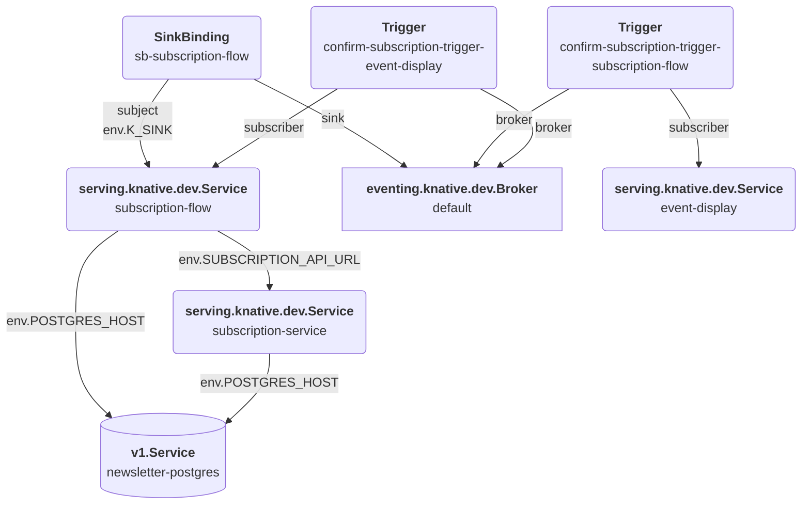

# Objective
Purpose of this project is to run one of the examples of the Kogito Serverless Workflow available under the 
[kogito-examples](https://github.com/kiegroup/kogito-examples/tree/stable/serverless-workflow-examples) repository
using the [Serverless Framework](http://serverless.com) in the OpenShift environment.

The selected examples is the [Newsletter Subscription Showcase](https://github.com/kiegroup/kogito-examples/tree/stable/serverless-workflow-examples/serverless-workflow-newsletter-subscription), in the `stable` branch as of July 12, 2022.

# Prerequisites
* Node (tested with version `v16.15.0`)
* Docker (tested with `Docker Engine - Community`, client version `20.10.14`, engine version `20.10.12`)
* [Docker Hub](https://hub.docker.com/) credentials
  * Environment variables `DOCKER_HUB_USERNAME` and `DOCKER_HUB_PASSWORD` set to define the access credentials
* Serverless Framework (tested with `framework 3.20.0, plugin 6.2.2, SDK 4.3.2`)
  * The initial project was created with the command: `serverless create --template knative-docker --path newsletter-subscription`
* OpenShift `4.8+`
  * Red Hat OpenShift Serverless `1.20+`
* JDK 11+ and Maven 3.8+ to build the Quarkus application
* Of course, we assume this runs from a `bash` shell
  
# System Architecture
As described by the following architectural diagram, the system is made of 4 services:
1. `subscription-service` is a Quarkus REST service exposing the subscription APIs. It is a serverless Knative Service
1. `subscription-flow` is a Quarkus service defined using the Kogito implementation of the [Serverless Workflow](https://serverlessworkflow.io/). It is also a serverless Knative Service
1. `event-display` it's another serverless Knative Service whose purpose is to connect to the event broker and print the [Cloud Events](https://cloudevents.io/) it is subscribed for
1. `newsletter-postgres` is a regular OpensShift Deployment which implements the subscription data store with a PosgreSQL database



The following Knative Eventing resources connect the serverless components:
1. A `SinkBinding` instance connect the `default` Broker to the `subscription-flow`, so it can send events of type `new.subscription`
2. A `Trigger` instance to forward events of type `confirm.subscription` from the `default` Broker to the `subscription-flow` Service
3. A `Trigger` instance to forward events of type `new.subscription` from the `default` Broker to the `event-display` Service

```mermaid
graph TD
   subgraph subscription-flow 
      subscription-flow-ui(<b>webapp</b><br/>subscription-flow-ui)
      subscription-flow-svc(<b>serving.knative.dev.Service</b><br/>subscription-flow)
   end
   subscription-service(<b>serving.knative.dev.Service</b><br/>subscription-service)
   broker[<b>eventing.knative.dev.Broker</b><br/>default]
   event-display(<b>serving.knative.dev.Service</b><br/>event-display)
   newsletter-postgres[(<b>v1.Service</b><br/>newsletter-postgres)]


   subscription-flow-svc -.process_instance table.-> newsletter-postgres
   subscription-flow-svc -.HTTP GET verify/.-> subscription-service
   subscription-flow-svc -.HTTP POST subscribe/.-> subscription-service
   subscription-flow-svc -.HTTP PUT confirm/.-> subscription-service
   subscription-flow-svc -.new.subscription.-> broker
   subscription-flow-ui -.confirm.subscription.-> broker

   subscription-service -.newsletter_sub table.-> newsletter-postgres

   broker -.new.subscription.-> event-display
   broker -.confirm.subscription.-> subscription-flow

```
# Design using the Serverless Framework
The design of an application based on the [Serverless Framework](http://serverless.com) starts from the [serverless.yaml](./serverless.yml) that defines the basic components of the architecture:
* [Functions](https://www.serverless.com/framework/docs/providers/aws/guide/functions) define the configuration of each serverless function and are mapped to instances of Knatice Service
* [Events](https://www.serverless.com/framework/docs/providers/aws/guide/events) define the actions that trigger the functions to run and are mapped to Knative Eventing instances of different type (e.g., the
  `custom` event type is mapped to a `Knative Trigger` and so on)

Even if the framework is implemented to work with AWS cloud by default, a [Knative provider](https://www.serverless.com/framework/docs/providers/knative) has been developed to deploy the configured applications on the OpenShift platforms where the [Knative](https://knative.dev/docs/)
technology has been configured to run serverless containers.

The next sections describe the updates applied to the `Knative provider` to comply with the latest version of the `Knative` framework
and the detailed design of each component of the application architecture.

## Updates to the Knative provider
### serverless-knative plugin
The `serverless-knative` plugin is the entry point of the Knative provider, and it was updated to:
* Manage version `v1` instead of `v1alpha1`
* Avoid references to the `istioIngressIp` field which is not returned by default
* Skip SSL authorization when invoking HTTPS service URLs
* Manage multi-function services instead of a single function per service in the `serverless info` operation
* Add the `sinkBinding` event type to model Knative `SinkBinding` resources
* Create the `default` Knative `Broker`
* Avoid duplicated names with multiple events of the same type by providing the option to add a custom `name`
* Update the dependencies in the `package.json` file to fetch the updated implementations of `knative-serving` and
 `knative-eventing` from the forked git repos (see next sectinos)

The updated source code is available at this [forked git repo](https://github.com/dmartinol/serverless-knative)

## knative-serving 
The `knative-serving` is a Node.js component defining the adaptation layer between the `Serverless Framework` and the `Knative Serving` resources. Main updates in the [forked git repo](https://github.com/dmartinol/knative-serving) are:
* Manage version `v1` instead of `v1alpha1`
* Apply framework changes as the original code was developed from an old version of the `Serverless Components` which is no more compliant sith the latest version of the `Serverless Framework`
* Manage multi-function services instead of a single function per service in the `serverless info` operation

## knative-eventing 
The `knative-eventing` is a Node.js component defining the adaptation layer between the `Serverless Framework` and the `Knative Eventing` resources. Main updates in the [forked git repo](https://github.com/dmartinol/knative-eventing) are:
* Manage version `v1` instead of `v1alpha1`
* Apply framework changes as the original code was developed from an old version of the `Serverless Components`
* Automatically create the `Knative Broker` instance using the [eventing.knative.dev/injection](https://knative.dev/docs/eventing/broker/triggers/#trigger-annotations)
  annotation

## Application design
### newsletter-postgres service
The configuration is defined in [newsletter-postgres.yaml](./newsletter-postgres/newsletter-postgres.yaml) and can be applied as:
```bash
oc create namespace newsletter-subscription-db
oc adm policy add-scc-to-user anyuid -z default -n newsletter-subscription-db
oc apply -f newsletter-postgres/newsletter-postgres.yaml
```

### Serverless Framework service
The overall service is called `newsletter` and this has some impacts on the name of the involved resources and
the configured properties, as we'll see later.

The main impact is that a namespace called `sls-newsletter-dev` will be created (`dev` is the default stage and can be 
changed using the `--stage` option in the `serverless` commands)

### subscription-service Service
The code of [subscription-service](./subscription-service/) was copied from the original git repository, no other changes are needed.

The [Dockerfile.jvm](./subscription-service/Dockerfile.jvm) to build this Quarkus based application was taken from 
[QuickStarts for Getting Started Guides](https://github.com/quarkusio/quarkus-quickstarts/blob/main/getting-started/src/main/docker/Dockerfile.jvm). In addition to that, we've added two `ENV` variables to match the `newsletter-postgres` deployment:
```dockerfile
ENV POSTGRES_PASSWORD=cGFzcwo=
ENV POSTGRES_HOST=newsletter-postgres.newsletter-subscription-db
```

**Note**: adding `ENV` variables to the `Dockerfile` is the only option to by-pass the current limitation of the `knative-serving` 
module that does not allow to configure the container properties in the `serverless.yaml` configuration.

The `subscription-service` service is defined as a Serverless Framework function:
```yaml
funtions:
  subscription-service:
    handler: Dockerfile.jvm
    context: ./subscription-service
```

When the service is deployed, the following happens:
* A Docker image called `$DOCKER_HUB_USERNAME/newsletter-subscription-service` will be generated from the `Dockerfile.jvm` and pushed to Docker Hub
* A Knative Service `newsletter-subscription-service` is created, running Pods with the above image

### subscription-flow Service
The `subscription-flow` service is based on a pre-built image of the original example, that is available on [Quay.io](http://quay.io/dmartino/serverless-workflow-newsletter-subscription-flow:2.0.0-SNAPSHOT), as specified in the associated [Dockerfile.jvm](./subscription-flow/Dockerfile.jvm). The `Dockerfile` also overrides the default image providing some extra `ENV` properties:
```dockerfile
ENV SUBSCRIPTION_API_URL=http://newsletter-subscription-service.sls-newsletter-dev.svc.cluster.local
ENV POSTGRES_HOST=newsletter-postgres.newsletter-subscription-db
```

The `subscription-flow` service is defined as a Serverless Framework function:
```yaml
functions:
  subscription-flow:
    handler: Dockerfile.jvm
    context: ./subscription-flow
    events:
      - custom:
          filter:
            attributes:
              type: confirm.subscription
      - sinkBinding: {}
```
When the service is deployed, the following happens:
* A Knative Service `newsletter-subscription-flow` is created, running Pods with the specified image
* A Knative Broker with the name `default` is created using the default implementation 
* A Knative Trigger with the standard name `newsletter-subscription-flow-custom` is created to receive events of type `confirm.subscription`
* A Knative SinkBinding with the standard name `newsletter-subscription-flow-sinkBinding` is created to connect the `default` Broker to the
 `newsletter-subscription-flow` service

**Note**: before installing the service, we must build the Quarkus application as:
```bash
cd subscription-service
mvn clean package
```

### event-display Service
The `event-display` service is deployed starting from the image in the `Google Cloud Container Registry`:

```yaml
functions:
  event-display:
    handler: gcr.io/knative-releases/knative.dev/eventing-contrib/cmd/event_display@sha256:a214514d6ba674d7393ec8448dd272472b2956207acb3f83152d3071f0ab1911
    events:
      - custom:
          name: new.subscription.2.event-display
          filter:
            attributes:
              type: new.subscription
      - custom:
          name: confirm.subscription.2.event-display
          filter:
            attributes:
              type: confirm.subscription
```

When the service is deployed, the following happens:
* A Knative Service `newsletter-event-display` is created, running Pods with the specified image
* A Knative Trigger with the configured name `new.subscription.2.event-display` is created to receive events of type `new.subscription`
* A Knative Trigger with the configured name `confirm.subscription.2.event-display` is created to receive events of type `new.confirm.subscription`

# Installing the application
Install the Node dependencies and deploy the application in the default `sls-newsletter-dev` namespace:
```bash
npm install
serverless deploy
```

Check the status:
```bash
serverless info
```

## Enable HTTP log traces
Enable the traces from the request module to see the details about the URLs, payloads and the requests:
```bash
NODE_DEBUG=request serverless deploy
```

# Testing the application
Run the applications using the default browser with:
```bash
open -t $(oc get ksvc newsletter-subscription-flow -n sls-newsletter-dev -ojsonpath='{.status.url}{"\n"}')
open -t $(oc get ksvc newsletter-subscription-service -n sls-newsletter-dev -ojsonpath='{.status.url}{"\n"}')
```

Then monitor the `event-display` logs with:
```bash
curl -k $(oc get ksvc newsletter-event-display -n sls-newsletter-dev -ojsonpath='{.status.url}{"\n"}')
oc logs -l serving.knative.dev/service=newsletter-event-display -f -n sls-newsletter-dev -c user-container
```
(Note: the Pod must be running)

# Unstall the application
Uninstall the application and the related DB resources:
```bash
serverless remove
oc delete -f newsletter-postgres/newsletter-postgres.yaml
oc delete namespace newsletter-subscription-db
```

# Troubleshooting
## Integration of RH Service Mesh
In case the `RH Service Mesh` has been integrated following the official [instructions](https://docs.openshift.com/container-platform/4.10/serverless/admin_guide/serverless-ossm-setup.html),
you might be unable to open the URLs exposed by the Knative services.
The following `server` must be added to the configuration of the `knative-ingress-gateway` Gateway in the `knative-serving` namespace, to
allow the traffic being forwarded to Knative Services that are exposing HTTP port 80:
```yaml
  servers:
    - hosts:
        - '*'
      port:
        name: http
        number: 80
        protocol: HTTP
```
